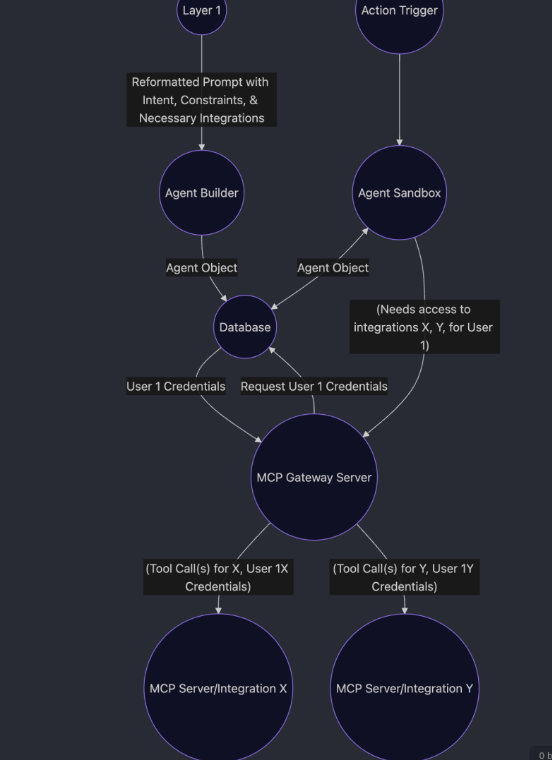
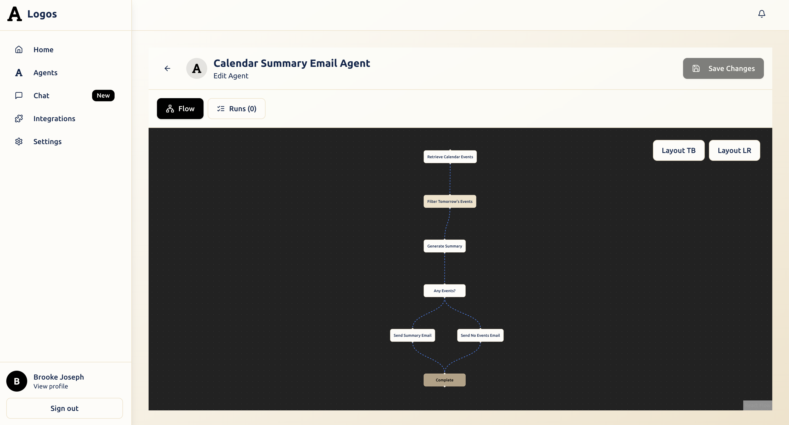
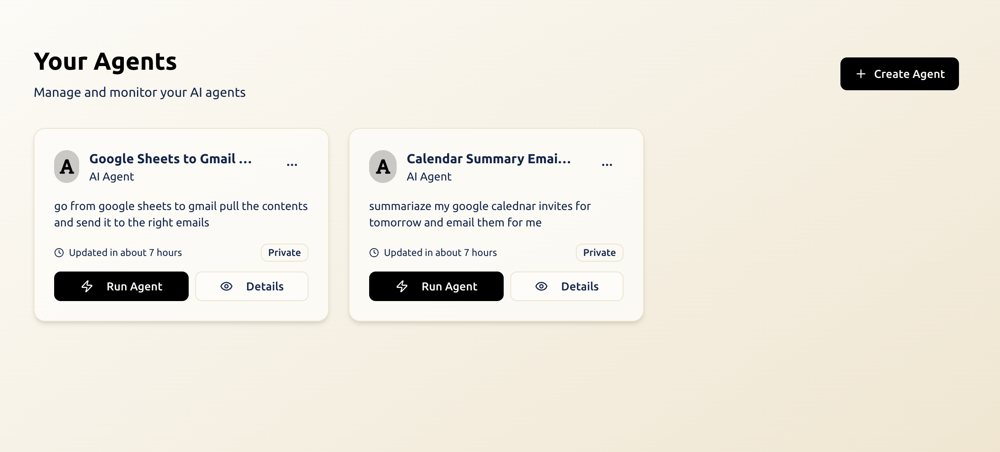
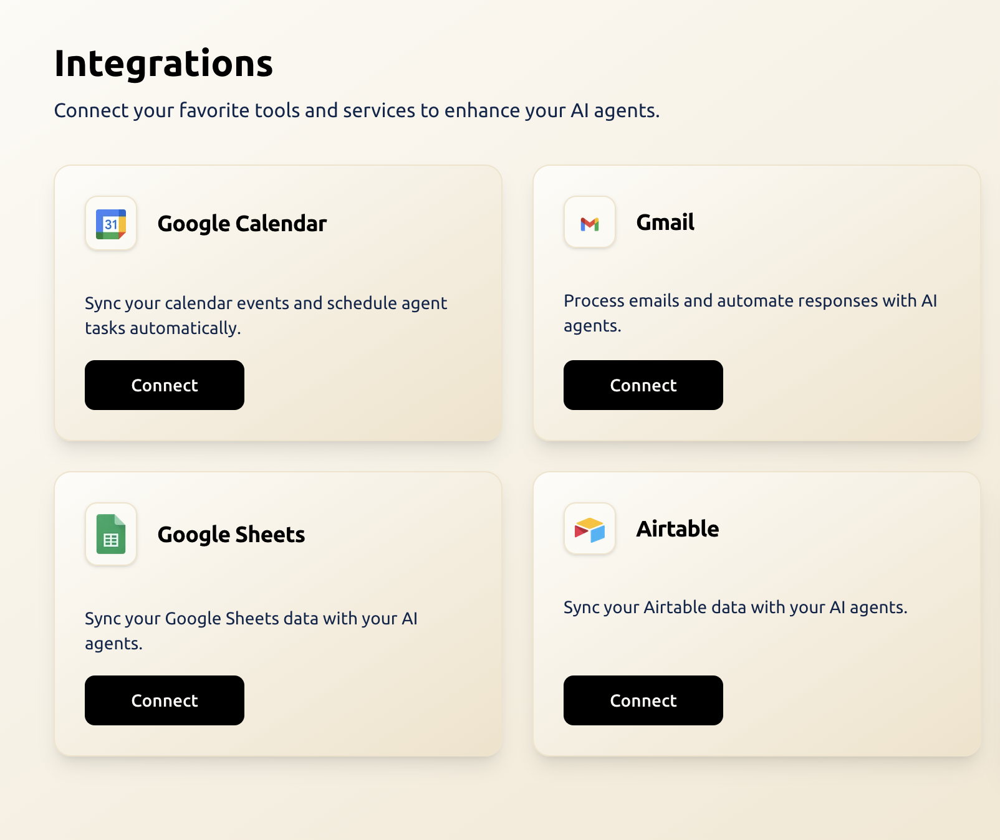

# Logos AI Platform



A complete AI agent platform that lets users create, deploy, and manage intelligent agents with real-world integrations. Built with a microservices architecture using Next.js, Python, and the Model Context Protocol (MCP).

## What Is This?

Logos is a platform where people can create AI agents that actually get things done. Think "AI assistant that can read your emails, schedule meetings, and manage your Google Drive" rather than just a chatbot. Users describe what they want their agent to do in plain English, and the system builds a working agent that can interact with their apps and services.

## Architecture Overview

Our system is built with several key components that work together:

```
┌─────────────┐    ┌─────────────────┐    ┌─────────────────┐
│   Frontend  │    │   Agent Sandbox │    │ Integration     │
│  (Next.js)  │    │   (Testing)     │    │ Gateway (MCP)   │
│             │    │                 │    │                 │
│ • Agent UI  │    │ • Workflow Test │    │ • Gmail API     │
│ • Chat      │────│ • Integration   │────│ • Slack API     │
│ • OAuth     │    │   Validation    │    │ • Drive API     │
│             │    │ • Debug Tools   │    │ • + More        │
└─────────────┘    └─────────────────┘    └─────────────────┘
        │                    │                        │
        └────────────────────┼────────────────────────┘
                            │
                    ┌─────────────────┐
                    │    Database     │
                    │   (Supabase)    │
                    │                 │
                    │ • User Data     │
                    │ • Agent Config  │
                    │ • OAuth Tokens  │
                    │ • Chat History  │
                    └─────────────────┘
```

## Repository Structure

This monorepo contains three main applications:

### 🖥️ **logos-frontend** - Web Interface

The main user interface built with Next.js 14. This is where users:

- Create and configure AI agents
- Chat with their agents in real-time
- Manage integrations with external services
- View agent execution logs and history

**Tech**: Next.js 14, TypeScript, Tailwind CSS, Supabase
**Role**: Layer 1 + Agent Builder from architecture diagram

### 🔌 **logos-I** - Integration Gateway (MCP Server)

The backend service that handles all external integrations. This Python server:

- Manages OAuth tokens and API authentication
- Provides tools for Gmail, Slack, Google Drive, Airtable, etc.
- Uses the Model Context Protocol for clean agent communication
- Handles rate limiting and error recovery

**Tech**: Python, FastAPI, MCP Protocol
**Role**: MCP Gateway Server + Individual Integration Servers from architecture diagram

### 🧪 **logos-sandbox** - Testing Environment

The development and testing environment where agents are validated before deployment:

- Test agent workflows safely without affecting real data
- Debug agent behavior with comprehensive logging
- Prototype new features and integrations
- Run automated tests for reliability

**Tech**: Python, Workflow Engine, Test Framework
**Role**: Agent Sandbox from architecture diagram

## Quick Start

### 1. Clone and Install

```bash
git clone https://github.com/toni-akintola/logos.git
cd logos

# Install frontend dependencies
cd logos-frontend
npm install

# Install backend dependencies
cd ../logos-I
python -m venv venv
source venv/bin/activate  # Windows: venv\Scripts\activate
pip install -r requirements.txt

# Install sandbox dependencies
cd ../logos-sandbox
python -m venv venv
source venv/bin/activate  # Windows: venv\Scripts\activate
pip install -r requirements.txt
```

### 2. Set Up Environment Variables

Each component needs its own `.env` file. See the individual README files for detailed setup:

- **Frontend**: `.env.local` with Supabase and API keys
- **Integration Gateway**: `.env` with OAuth credentials and database URL
- **Sandbox**: `.env` with testing configuration

### 3. Start All Services

```bash
# Terminal 1: Start the integration gateway
cd logos-I
python main.py

# Terminal 2: Start the frontend
cd logos-frontend
npm run dev

# Terminal 3: Run sandbox tests (optional)
cd logos-sandbox
python workflow_tests.py
```

Visit `http://localhost:3000` to see the application.

## How It All Works Together

### Agent Creation Flow

1. **User describes agent** in the frontend → "I want an agent that summarizes my daily emails"
2. **Frontend parses intent** → Identifies goal, constraints, required integrations (Gmail)
3. **Agent configuration saved** → Stored in database with workflow definition
4. **User connects Gmail** → OAuth flow handled by frontend, tokens stored securely

### Agent Execution Flow

1. **User triggers agent** → Through chat interface or scheduled trigger
2. **Frontend requests execution** → Sends agent config + user context
3. **Integration gateway called** → Retrieves user's Gmail emails using stored OAuth tokens
4. **Results returned** → Email summaries displayed in chat interface

### Testing and Development

1. **New integration developed** → Created in logos-I with proper MCP tools
2. **Testing in sandbox** → Validated with test workflows and mock data
3. **Frontend integration** → UI components added for new integration
4. **Production deployment** → All components deployed together

## Available Integrations

| Service             | What It Does                      | OAuth Required |
| ------------------- | --------------------------------- | -------------- |
| **Gmail**           | Read, send, search emails         | Yes            |
| **Google Calendar** | Create events, check availability | Yes            |
| **Google Drive**    | Upload, download, search files    | Yes            |
| **Google Sheets**   | Read, write spreadsheet data      | Yes            |
| **Slack**           | Send messages, read channels      | Yes            |
| **Airtable**        | Query databases, create records   | API Key        |
| **Exa Search**      | Semantic web search               | API Key        |

## Development Workflow

### Adding a New Integration

1. **Create integration in logos-I**

   ```bash
   cd logos-I/integrations
   # Create new_service.py with OAuth and tools
   ```

2. **Add to tool registry**

   ```python
   # In logos-I/tools/__init__.py
   from .new_service import register_tools
   register_tools(mcp)
   ```

3. **Add frontend UI**

   ```bash
   cd logos-frontend/src/components/integrations
   # Create integration button and OAuth flow
   ```

4. **Test in sandbox**
   ```bash
   cd logos-sandbox
   # Create test workflow using new integration
   python workflow_tests.py
   ```

### Debugging Issues

Each component has comprehensive logging:

- **Frontend**: Browser dev tools + Next.js logs
- **Integration Gateway**: Python logs with request/response details
- **Sandbox**: Detailed execution traces and performance metrics

## Security Considerations

- **OAuth tokens encrypted** in database
- **API keys in environment variables** only
- **Request validation** at all service boundaries
- **Rate limiting** on external API calls
- **Audit logging** for all agent actions

## Deployment

### Development

- Frontend: `npm run dev` (localhost:3000)
- Gateway: `python main.py` (localhost:8080)
- Database: Supabase hosted or local instance

### Production

- Frontend: Deploy to Vercel, Netlify, or similar
- Gateway: Deploy to Railway, Render, or container platform
- Database: Managed Supabase instance
- Environment variables: Set in deployment platform

## Contributing

Each repository has its own contribution guidelines, but generally:

1. **Follow existing patterns** - Look at current code structure
2. **Add comprehensive tests** - Especially for new integrations
3. **Update documentation** - Keep READMEs current
4. **Test cross-service compatibility** - Ensure changes work across all components

## Getting Help

- **Integration issues**: Check logos-I README and logs
- **Frontend bugs**: Check logos-frontend README and browser console
- **Testing problems**: Check logos-sandbox README and execution logs
- **Architecture questions**: Review this README and the individual component docs

This platform is designed to make AI agents actually useful in the real world. Each component plays a crucial role in making that happen - from the user-friendly interface to the robust integration handling to the comprehensive testing environment.

## Demo




